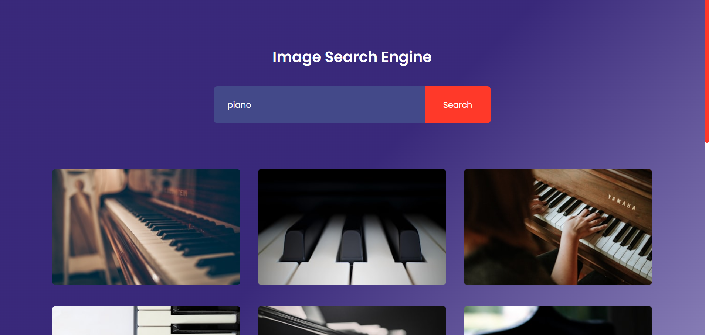

# 📸 Image Search Engine (Unsplash API + Node Backend)

<!-- GitHub Stats -->


<!-- Deployment Badges -->


<!-- Project Features -->


-brightgreen)

A **modern, full-stack Image Search Engine** leveraging the Unsplash API via a secure Node.js backend. This project delivers a fast, responsive user experience with infinite-style pagination, demonstrating best practices in front-end development (HTML, CSS, JavaScript) and secure API key management (Node.js/Express).

---

## 🚀 Live Demo & Deployment

The application is split into two separately deployed components, showcasing a modern service-oriented architecture.

| Component | Deployment Platform | URL |
| :--- | :--- | :--- |
| **🌐 Frontend (Client)** | **Vercel** | [https://image-search-engine-sooty.vercel.app](https://image-search-engine-sooty.vercel.app) |
| **⚙️ Backend (API Proxy)** | **Render** | [https://image-search-engine-2.onrender.com](https://image-search-engine-2.onrender.com) |

---

## 📸 Screenshot



---

## ✨ Features

* **🔍 Secure Image Search:** Fethes high-quality images using the Unsplash API, ensuring the API key is **securely hidden** and proxied via the Node/Express backend.
* **📜 Infinite-Style Pagination:** Uses a **"Show More"** button to seamlessly load additional image results.
* **⚡ Optimized UX:** Includes a **loading indicator** to manage perceived performance, especially during initial backend spin-up (Render free tier).
* **📱 Fully Responsive Design:** Images display in a **dynamic grid layout** on desktops and a clean, stacked column view on mobile devices.
* **🔗 Direct Linking:** Clicking any image opens the original photo page on Unsplash in a new tab.

---

## ⚙️ Technologies Used

<!-- Tech Stack -->


This project utilizes a standard MERN-stack architecture (without MongoDB) for a complete full-stack experience.

### **🌐 Frontend**
* **HTML5, CSS3, JavaScript (Vanilla JS):** For a lightweight, fast, and dependency-minimal client.
* **Vercel:** High-performance static site deployment.

### **🖥️ Backend (API Proxy)**
* **Node.js:** Server-side JavaScript runtime.
* **Express.js:** Minimalist web application framework for handling routing and API calls.
* **Unsplash API:** Primary data source for images.
* **`dotenv`:** Secure management of environment variables (`UNSPLASH_KEY`).
* **Render:** Cloud platform for hosting the Node.js API service.

---

## 🛠️ Setup & Local Installation

Follow these steps to get the project running on your local machine.

### **1. 🔑 Unsplash API Key**

1.  Go to [Unsplash Developers](https://unsplash.com/developers) and create a new application.
2.  Obtain your **Access Key**. You will need this for the backend setup.

### **2. Project Clone**

```sh
git clone https://github.com/TonyStark-19/Image-Search-Engine.git
cd Image-Search-Engine
```

### ***3. 🖥️ Backend Setup (Node + Express)***

```sh
# Go to the backend directory
cd backend

# Install dependencies
npm install

# Create a .env file and add your Unsplash Access Key
echo "UNSPLASH_KEY=YOUR_ACCESS_KEY_HERE" > .env

# Start the server
npm start
```
The backend API will run on http://localhost:3000.

### 4. 🌐 Frontend Setup (HTML, CSS, JS)
The frontend is a static web application.

```sh
# Go to the frontend directory
cd frontend
```

**Configuration:** Before opening the frontend, you must update the API endpoint it uses.

- Open `script.js.`
- Locate the base URL for the API call and change it from the deployed Render URL to your local backend address: `http://localhost:3000.`

Run: Simply open `index.html` in your web browser or use a live server extension (like VS Code's Live Server).

---

### 🎯 How to Use (Client Walkthrough)

1.  **Search:** Enter any keyword (e.g., "nature," "abstract," "coffee") in the search bar and press **Enter** or click **Search**.
2.  **View:** Image results will populate the screen in a responsive grid.
3.  **Details:** Click on any image tile to be directed to the full-size image on the Unsplash website.
4.  **Pagination:** Click the **"Show More"** button at the bottom of the results to fetch the next set of images.

---

## 🤝 Contributing

Contributions are welcome! If you find a bug or have a suggestion for an improvement:

1.  Fork the repository.
2.  Create a new branch (`git checkout -b feature/AmazingFeature`).
3.  Commit your changes (`git commit -m 'Add some AmazingFeature'`).
4.  Push to the branch (`git push origin feature/AmazingFeature`).
5.  Open a Pull Request.

---

Made with ❤️ by [TonyStark-19](https://github.com/TonyStark-19) (Aditya Chandel)

