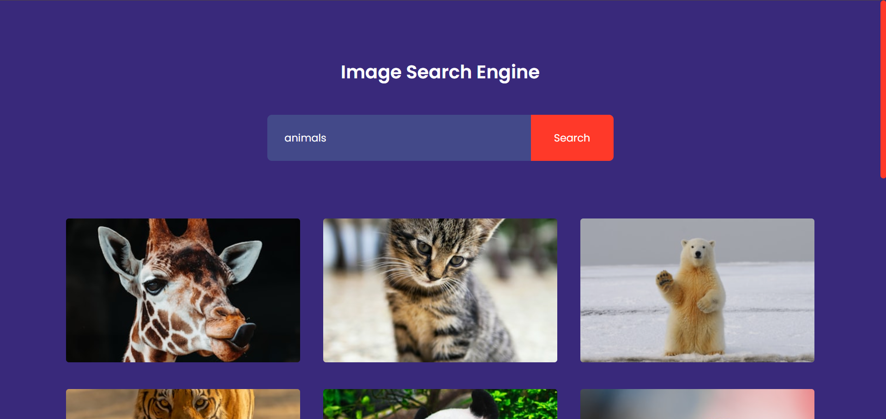

## 🖼️ Image Search App

A simple **Image Search App** built using **HTML, CSS, and JavaScript**, powered by the **Unsplash API**. This project allows users to search for images and load more results dynamically. The app is fully responsive and works seamlessly on different screen sizes.

---

## 🚀 Live Demo

🔗 View live deployment : [image-search-engine](https://image-search-engine-sooty.vercel.app/)

---

## 📸 Screenshot


---

## 🛠️ Features

- 🔍 Search for high-quality images using **Unsplash API**
- 📜 Load more images dynamically with the "Show More" button
- 🔗 Click on images to view them in full size on Unsplash
- 📱 Fully responsive design for mobile and desktop screens

---

## 🏗️ Technologies Used

- **HTML** for structure
- **CSS** for styling and responsiveness
- **JavaScript** for fetching and displaying images dynamically
- **Unsplash API** for image search functionality

---

## ⚙️ Setup & Installation

1. **Clone the repository**
   
   ```sh
   git clone https://github.com/TonyStark-19/image-search-app.git
   ```
3. **Navigate to the project folder**
   
   ```sh
   cd image-search-app
   ```
5. **Open `index.html` in your browser** or use Live Server for best experience.

---

## 🔑 API Key Setup

This project uses the **Unsplash API**. To use it, get your API key:
1. Go to [Unsplash Developers](https://unsplash.com/developers)
2. Create a new app and get your **Access Key**
3. Replace the value of `accessKey` in `script.js`:

   ```js
   const accessKey = "YOUR_ACCESS_KEY_HERE";
   ```

---

## 🎯 How to Use

1. **Enter a keyword** in the search box and hit "Search"
2. **View image results** from Unsplash
3. **Click an image** to view the full version
4. **Click "Show More"** to load additional results

---

## 🖥️ Responsive Design

This project is designed to be **fully responsive**. Images are displayed in a **grid format on larger screens** and **stacked in a column on smaller screens** for the best user experience.

---

## 🤝 Contributing

Feel free to fork the project, make improvements, and submit a pull request.

---

Made with ❤️ by Aditya chandel

